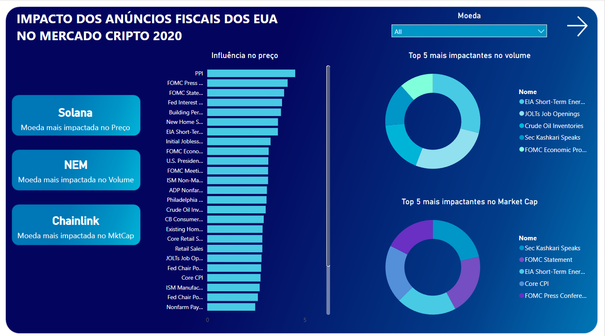

# Análise do Mercado Cripto 2020

### Visão Geral

Esse projeto de análise de dados tem como objetivo fornecer insights sobre o mercado de criptomoedas. Atráves da análise de diversos pontos cruciais para o mercado cripto, busquei identificar padrões e fornecer de forma clara um melhor entendimento do mercado. 

### Fonte de dados

[Coin_Raw](https://www.kaggle.com/datasets/sudalairajkumar/cryptocurrencypricehistory/data): O data set primário do projeto, contendo informações detalhadas de 23 das principais moedas do mercado de 2020 como preço, data, market cap e volume.

[Calendar_Raw](https://www.kaggle.com/datasets/devorvant/economic-calendar/data?select=D2019-21.csv): O data set de apoio usado primariamente na primeira página do relatório, contendo o nome dos anúncios fiscais, países, volatilidade esperada e data.

### Ferramentas

- Python(Pandas) - Limpeza inicial dos datasets
- PowerBI - Limpeza dos dados, modelagem dos dados, criação dos cálculos lógicos e visualização interativa.

### Limpeza e preparação dos dados

Na fase inicial do projeto foram seguidas as seguintes etapas:

- Limpeza inicial dos .csv utilizando pandas para fazer a primeira seleção de colunas e valores conforme escopo do projeto.
  - Utilizando um notebook python [Calendar_cleanup](https://github.com/LuanHott/Analise_MercadoCripto2020/blob/main/notebooks/calendar_cleanup.py) , realizei a limpeza selecionando apenas o nome e a data dos anúncios fiscais realizados no ano de 2020, que possuiam alta volatilidade esperada e foram realizados nos EUA. O resultado pode ser encontrado [aqui](https://github.com/LuanHott/Analise_MercadoCripto2020/blob/main/data/Calendar_Clean/calendar_clean.csv)
  - Utilizando de uma lógica similar [Coin_cleanup](https://github.com/LuanHott/Analise_MercadoCripto2020/blob/main/notebooks/coin_cleanup.py), realizei a limpeza 

### Análise de dados exploratória

### Análise de dados
'''

'''
### Resultados/Descobertas

### Limitações

